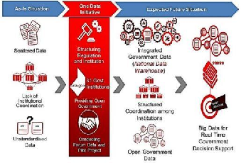

# Introduction

This report on data governance in Indonesia is part of the “Harnessing Data for Democratic Development in South and Southeast Asia” (D4DAsia) project which aims, *inter alia*, to create and mobilize new knowledge about tensions, gaps, and the evolution of the data governance ecosystem taking into account formal and informal policies and practices.

In today’s digital age, data governance ecosystems play a crucial role in shaping our societies. These ecosystems, comprising policies, laws, practices, behaviours, and technologies, aim to govern data in ways that protect rights, foster innovation, enhance transparency, and ultimately promote democratic and inclusive governance. However, the landscape of data governance is complex and often fraught with challenges, particularly in South and Southeast Asia.

Data governance ecosystems are made up of policies, laws, practices, behaviours, and technologies that govern data. An ideal data governance system would protect rights, enable innovation, improve transparency, and help in bringing about democratic, inclusive governance. Through the rest of the report, unless the context indicates otherwise, the term “policies” is used as shorthand for policies, statutes, regulations, rules, administrative orders, and even practices and technologies that are used to implement all of those as part of the data governance ecosystems.

Data is increasingly being recognised as an enabler for development. It is an essential requirement for policy making and monitoring of development goals and targets. When effectively managed, data can be used as an asset to support significant development actions such as poverty reduction, food security, mitigating impact of climate change, and disaster management. If mismanaged, it can exacerbate inequalities and undermine the development potential of the same actions.

The D4DAsia project has produced nine reports so far, seven detailed individual country reports which deal with the issues of data governance in the following countries: India, Indonesia, Nepal, Pakistan, Philippines, Sri Lanka and Thailand; a detailed look at data protection in South Korea; and a synthesis report that summarizes the findings from the various countries while drawing out the contrasts amongst them, along with detailed findings to the research questions we’d posed, which were:

1.  What is common, and what is nationally specific, in the emerging data governance architectures in South and Southeast Asia? What are the explanations?
2.  What are the implications of the emergent nature of the governance architecture? Because there is no overall design that envisions how the parts fit together, it is likely that there will be friction points and even contradictions. How are these being worked out?
3.  The emerging governance architecture involves trade-offs among objectives such as greater accountability of powerholders, economic growth including creation of employment and wealth, resilience of systems, etc. How have different societies: (a) explicitly recognized the trade-offs or not; and (b) handled them?
4.  Are there legislative or policy innovations with potential for replication? What are the modalities of sharing experiences? Are developing countries learning from each other, or are they learning from the developed countries?
5.  How were the laws and bills developed? What expertise was brought to bear? How open were the procedures? How receptive were drafters to suggestions and criticisms?
6.  How were capacity challenges addressed: by simplifying the laws or by tolerating incomplete implementation?

## Structure of the report

### Governance Background

This report provides contextual information about Indonesia’s constitutional and governance framework, beginning with the 1945 Constitution of the Republic of Indonesia (“UUD 1945”), which establishes a presidential system with a clear separation of powers. It examines how lawmaking authority is exercised by the President and the House of Representatives (“DPR”), as well as the judiciary’s role in safeguarding rights through the Constitutional Court’s (“MK”) judicial review process. The report also details the Law No. 12 of 2011 regarding the hierarchy of norms, which ensures that implementing regulations at the ministerial level remain aligned with national laws.

### Increasing Openness / Access

This section discusses policies that facilitate greater data access for citizens and foster interoperability. A central pillar is the Public Information Disclosure Act (“UU KIP”) of 2008 as Indonesia’s Right to Information (RTI) law, which mandates that public bodies fulfill their disclosure obligations through Information and Documentation Management Officers (PPID). Furthermore, it evaluates systemic initiatives like One Data Indonesia (Satu Data Indonesia/SDI) and the Electronic-Based Government System (SPBE), which aim to standardize data formats and metadata for integrated, “whole-of-government” transparency.

### Decreasing Openness / Access

The report moves on to discuss laws and practices that restrict access to data, often justified by national security, privacy, and economic stability. It analyzes Article 17 of UU KIP, which enumerates ten categories of exempt information, and Law No. 17 of 2011 on State Intelligence as the State Intelligence Law (SIL), which can lead to over-classification of sensitive data. Additionally, it explores the Law No. 27 of 2022 on Personal Data Protection (“UU PDP”), noting broad exceptions for law enforcement and national defense that may “contract” the space for public access.

### Deep Dives: Policy Frictions and Trade-offs

The final part of the report examines the persistent gaps between normative legal aspirations and their actual implementation on the ground. It explores critical trade-offs, such as the tension between high data quantity and low data quality, where massive datasets collected by agencies like Statistics Indonesia (BPS) may still lack the accuracy required for effective real-time policymaking. There is also a notable friction between the centralized mandates of the National Data Center (“NDC”) and Indonesia’s decentralized administrative geography, which requires local responsiveness that a unified portal may struggle to provide. Finally, the report highlights co-creation as a potential equilibrium mechanism, suggesting that involving non-governmental actors through initiatives like Open Government Indonesia (“OGI”) can help reconcile the state’s regulatory control with the public’s right to participate in governance.

# Country Overview

## Legal Foundation

Indonesia’s legal and constitutional framework is founded on the UUD 1945, which has undergone several amendments, particularly following the fall of the Soeharto regime in 1998. As a unitary state, Indonesia is governed as a single entity under a centralized authority, while regional governments exercise limited autonomy based on powers delegated by the central government. The state adopts a separation of powers among the executive, legislative, and judicial branches.

The President, elected directly by the people, serves as both Head of State and Head of Government, while legislative authority rests with the People’s Consultative Assembly (“MPR”), comprising the Regional Representative Council (“DPD”) and the House of Representatives (“DPR”). The judiciary operates independently, with the Supreme Court (MA) serving as the highest judicial authority and the Constitutional Court (MK) empowered to review legislation to ensure conformity with the Constitution.[@lindseyIndonesianLaw2018]

Indonesia’s legal system follows the civil law tradition, heavily influenced by Dutch colonial law, customary (*Adat*) law, and Islamic law.[@levIslamicCourts1972; @pompeIndonesianSupreme2005] Statutory law serves as the primary source of law, encompassing acts enacted by the legislature and regulations issued by the executive branch. *Adat* law remains significant in rural and traditional communities, while Islamic law applies primarily to personal and family matters among Muslim citizens. Since the late 1990s, Indonesia has implemented a policy of decentralization, granting greater authority to regional governments to enhance democratic accountability and local service delivery.[@hofmanMakingBig2004]

Nonetheless, the central government retains control over key sectors such as defense, foreign affairs, and fiscal policy. This governance model seeks to balance central authority with regional autonomy, ensuring that legislation and policy remain consistent with constitutional principles.[@crouchPoliticalReform2015; @lindseyConstitutionalReform2008]

## Indonesia’s Data Governance Landscape

Data governance is a diverse ecosystem of arrangements, which includes technical, policy, regulatory, and institutional provisions, that governs the entire lifecycle of data from creation and collection to storage, protection, use, sharing, and final deletion. As a framework, it manages the inherent tensions between increasing data openness to foster innovation, democratic transparency and decreasing access to protect national security and individual privacy rights.

Indonesia’s data governance framework has evolved substantially since its early conception, guided by key legislative milestones that have progressively shaped its regulatory and institutional landscape. Foundationally, Article 28F of the UUD 1945 guarantees every individual the right to communicate and obtain information for personal and societal development.[@ConstitutionIndonesia1945] This constitutional principle was further institutionalized through UU KIP which marked a turning point in the nation’s commitment to transparency and accountability following the 1998 *Reformasi* movement.[@indonesiaPublicInformation2008; @swajatiKajianKebijakan2021]

Complementing the UU KIP framework, other pivotal legislations include Law No. 39 of 1999 on Human Rights, Law No. 25 of 2004 on the National Development Planning System, and Presidential Regulation No. 39 of 2019 on Satu Data Indonesia. Together, these laws underscore a coherent policy direction to ensure data openness, interoperability, and reliability in public decision-making.[@PresidentJokowi2019; @unitednationresidentcoordinationofficeSituationAnaylsis2021]

Effective data governance requires that both public and private entities possess the capacity to make informed, accountable, and legally compliant decisions regarding data use, value creation, and risk management. For a country as large and complex as Indonesia, this necessitates a structured governance system capable of minimizing fragmentation and ensuring that principles of transparency translate into enforceable practices.[@article19AsiaDisclosed2015; @worldeconomicforumArticulatingValue2021]

This report highlights four key dimensions of Indonesia’s evolving data governance ecosystem: (1) the institutionalization of transparency through the UU KIP; (2) the catalytic role of Indonesia’s participation in the Open Government Partnership (OGP) since 2011 in advancing open data systems; (3) the dual dynamic of policies that both promote and restrict data openness, where constitutional guarantees of access coexist with a “security-first” model, such as the State Intelligence Law and the centralization of data in the National Data Center, that can inadvertently contract public access; (4) the persistent gap between normative aspirations and implementation, often hindered by institutional fragmentation and over-classification.

# In the “Laws that Open Access” Section

## Law No. 14 of 2008 on Public Information Disclosure (“UU KIP”)

UU KIP enacted on 30 April 2008, represents a significant milestone in Indonesia’s democratic evolution and its data governance architecture. As Indonesia’s Right to Information legislation, it codifies citizens’ rights to access public information and sets forth detailed obligations for government agencies to disclose information both reactively and proactively.[@indonesiaPublicInformation2008] The law formally entered into effect in 2010, following a two-year preparatory period for institutional implementation.[@lubisIndonesiaPublic2018]

Article 2 (1) of the law explicitly provides that “all public information shall be open and accessible to users of public information, which includes Indonesian citizens and legal entities. All citizens and entities possess the right to request, view, understand, and obtain copies of and distribute public information.” Article 3 further delineates these rights, emphasizing the public’s entitlement to access, comprehend, and monitor policymaking processes, programs, and decision-making. These provisions underscore that access to information is not merely a procedural right but a substantive democratic entitlement, a precondition for meaningful participation and accountability.

The law classifies public information into three categories to be disclosed:

- Periodically, covering reports on institutional activities, performance, and financial management;
- Immediately, including information that could affect public safety and order; and
- At any time, it comprises documents such as agency policies, decisions and their rationales, work plans, annual budgets, and reports on public information service performance.

In operational terms, UU KIP imposes extensive obligations on public authorities[@indonesiaPublicInformation2008] to establish information and documentation management systems (Pejabat Pengelola Informasi dan Dokumentasi, PPID) responsible for processing and publishing information. These systems are designed to ensure consistent transparency, encourage public participation, and enhance the quality of governance.[@sakapurnamaGoodGovernanceAspect2013b] The law envisions transparency not merely as administrative compliance but as an enabler of scientific development, civic engagement, and policy accountability.[@FreedomPress2013]

To support implementation, the law created the Central Information Commission (Komisi Informasi Pusat/KIP), an independent body mandated to formulate technical standards for information services and adjudicate public information disputes. This body issued Regulation No. 1/2010 on Standard Public Information Services, which outlines minimum service standards for disclosure practices across public institutions. The KIP also provides non-litigious mechanisms, mediation and adjudication, for resolving access disputes, thereby institutionalizing citizens’ right to information through an accessible administrative process.

Conceptually, the UU KIP framework redefines the relationship between the state and the citizen by embedding transparency as a constitutional principle.[@mendelRightInformation2020] It aligns Indonesia’s governance framework with broader global trends emphasizing open data, civic participation, and human rights–based approaches to information access.[@banisarWhistleblowingInternational2011] In this sense, UU KIP serves not only as a transparency instrument but also as a foundational component of Indonesia’s data governance ecosystem, one that supports trust, accountability, and evidence-based policymaking.

While the enactment of UU KIP represents a significant milestone in Indonesia’s democratization process, the true test of its impact lies in the effective implementation of transparency standards across public institutions. The law’s success cannot be gauged solely by its existence as a legislative instrument but by the extent to which it translates into practical and enforceable rights for citizens.[@lubisIndonesiaPublic2018] Genuine government accountability requires that violations of UU KIP be subject to clear remedies, enabling citizens to challenge opacity and compel disclosure through established mechanisms such as the Information Commission.

In the longer term, however, the effectiveness of UU KIP depends not merely on legal enforcement but on the institutionalization of a culture of openness and accountability within the public sector. Sustainable transparency emerges when state institutions internalize the principle that information belongs to the public and that disclosure is the norm rather than the exception. Such a transformation demands not only regulatory compliance but also normative change, a shift in bureaucratic behavior driven by the recognition of citizens as rights-holders rather than passive recipients of government information.[@mcgeeShiftingPower2012; @foxUncertainRelationship2007]

## Open Government and the SDI Initiative

Indonesia’s commitment to transparency and data openness has evolved through a series of institutional and policy initiatives aimed at fostering accountability and participatory governance. Following the enactment of UU KIP, which laid the legal foundation for citizens’ right to access information, Indonesia advanced its transparency agenda through multilateral and national frameworks that promote open government and data-driven policymaking.

In 2011, Indonesia became one of the founding members of the Open Government Partnership (OGP), a global initiative that promotes transparent, participatory, and accountable governance. Through successive National Action Plans (Rencana Aksi Nasional), Indonesia has sought to strengthen public participation, improve access to government information, and enhance integrity in public service delivery.[@patraIndependentReporting2020] The OGP process also positioned Indonesia as a regional leader in promoting open data as a mechanism for innovation, civic engagement, and anti-corruption reform.[@opengovernmentindonesiaRencanaAksi2023]

Building on this momentum, the government launched One Data Indonesia (SDI) initiative, formally institutionalized through Presidential Regulation No. 39 of 2019.[@PresidentJokowi2019] The SDI framework aims to harmonize and standardize data governance across public institutions by ensuring interoperability, data quality, and accessibility. It establishes principles for data management that include the use of common standards, metadata, and reference codes, thereby promoting the production and utilization of accurate, integrated, and accountable data across both central and regional agencies.[@swajatiKajianKebijakan2021; @opengovernmentindonesiaPeranSatu2020]

Together, the OGP and SDI initiatives represent a critical evolution in Indonesia’s data governance landscape, from a rights-based approach emphasizing public access to information, toward a systemic and coordinated approach to data interoperability and governance. These frameworks not only facilitate transparency and evidence-based policymaking but also enable cross-sectoral collaboration and digital transformation in public administration.[@OpenData2017]

This legislation brought about a significant paradigm shift. The framework aspires to an ‘open-by-default’ model, though implementation remains partial.[@PresidentJokowi2019; @opengovernmentindonesiaPeranSatu2020] Under this policy regime, Indonesia established two key institutional mechanisms: (a) a Steering Council (SC), comprising ministers responsible for strategic sectors, tasked with coordinating policies, monitoring, evaluating, and reporting the progress of the SDI initiative; and (b) Central Data Trustees (CDT), mandated to formulate data standards, define metadata structures, provide policy recommendations, and support implementation efforts.[@swajatiKajianKebijakan2021; @unitednationresidentcoordinationofficeSituationAnaylsis2021] Through Ministerial Decree Number 31/M.PPN/HK/04/2021 concerning the Establishment of the Working Group for the Central-Level Indonesian One Data Forum, these functional units were formally institutionalized.[@opengovernmentindonesiaRencanaAksi2023; @patraIndependentReporting2020]

## Census Act (Law No. 16 of 1997 on Statistics)

The Law No. 16 of 1997 on Statistics, commonly referred to as the Census Act, serves as the foundational legal framework for statistical governance and data management in Indonesia. The law was enacted to establish a National Statistical System (NSS) that ensures the production and use of reliable, accurate, and timely statistical data to support evidence-based policymaking and national development planning.[@indonesiaStatisticsAct1997] It defines statistics as *“data obtained by collection, preparation, presentation, and analysis”* and introduces a systematic approach to regulating the relationship among various statistical actors and activities across government institutions.[@swajatiKajianKebijakan2021]

Under this law, the Central Statistics Agency (Badan Pusat Statistik/BPS) is designated as the main authority responsible for conducting statistical activities at the national level. These activities include:

- Censuses, carried out at least once every ten years, consisting of a Population Census, an Agricultural Census, and an Economic Census;
- Surveys, conducted periodically or as needed to obtain more detailed or thematic data;
- Intercensal Surveys, implemented to bridge information gaps between census years; and
- Compilation of Administrative Records, which utilizes data from administrative documents maintained by government and non-government entities.[@indonesiaStatisticsAct1997; @badanpusatstatistikDokumentasiKomprehensif2023]

The Census Act outlines that statistical activities must serve four key purposes [@indonesiaStatisticsAct1997]:

1.  to support national development;
2.  to strengthen a reliable, effective, and efficient National Statistical System;
3.  to enhance public awareness regarding the importance and role of statistics; and
4.  to support the advancement of science and technology.

Importantly, the Act also introduces a principle of openness in data access, stipulating that statistical data, unless restricted by specific legislation, should be publicly accessible and disseminated in the Official Statistics News (*Berita Resmi Statistik*) or through BPS offices at the national, provincial, and local levels.[@indonesiaStatisticsAct1997; @PresidentJokowi2019] This provision aligns with the country’s broader transparency framework as embodied in UU KIP, reinforcing data as a public good to be utilized for research, policy evaluation, and societal benefit.[@OpenData2017]

In practice, BPS has operationalized these principles through its open data portal, accessible via bps.go.id, which serves as a centralized hub for disseminating official statistics. The portal represents a significant institutional effort toward improving data interoperability, accessibility, and public participation in statistical use and analysis. As noted in the United Nations Resident Coordination Office (UNRCO) Situation Analysis (2021), this approach contributes to strengthening Indonesia’s data ecosystem and supporting policy coherence across sectors.[@unitednationresidentcoordinationofficeSituationAnaylsis2021]

# Openness/ Increasing Access

## Open Data, Laws, Policies, and Practices

The Government of Indonesia (GOI) has demonstrated sustained commitment to advancing digital governance and data-driven policymaking. The foundation of this commitment can be traced in Article 31 of Law Number 25 of 2004 on the National Development Planning System, which mandates that national development planning be based on accurate, reliable, and transparent data. This law positioned data not merely as a technical input but as a strategic national asset, central to evidence-based policy formulation and public accountability.[@indonesiaNationalDevelopment2004]

Despite this mandate, the early phases of Indonesia’s e-governance (2004–2018) were characterized by fragmented digital systems, siloed databases, and limited inter-agency coordination. Various ministries and local governments launched electronic service platforms, commonly referred to as *e-services*, that often operated independently, lacked interoperability, and faced sustainability challenges.[@worldbankUnicornsHarnessing2021] This fragmentation hindered the realization of an integrated “whole-of-government” data ecosystem that could support open data access and coordinated digital services.

### Presidential Regulation No. 95 of 2018 on Electronic-Based Government System (SPBE)

A major policy breakthrough came with the enactment of Presidential Regulation No. 95 of 2018 on SPBE.[@indonesiaElectronicBasedGovernment2018] This regulation formalized the framework for digital transformation in public administration, setting out principles for data management, interoperability, information security, and public service integration. The SPBE aims to strengthen coordination across ministries and agencies, streamline data standards, and improve service delivery through data-driven decision-making.

Article 13 establishes specific mandates regarding data governance, including the establishment of a national data center, uniform metadata standards, and audit mechanisms for information integrity. It further mandates that government entities manage data with due consideration for confidentiality, availability, and integrity, introducing for the first time a comprehensive regime for digital risk management and protection of classified information.[@indonesiaElectronicBasedGovernment2018]

The SPBE architecture also underpins Indonesia’s open data platforms at both national and subnational levels. The national open data portal, data.go.id, serves as the primary interface for citizens to access government datasets.[@PortalSatu] Several local governments have also developed regional portals, reflecting a decentralized model of open data implementation, for example, the West Java Province Open Data Portal (<https://opendata.jabarprov.go.id>), Jakarta Province’s One Data Portal (<https://satudata.jakarta.go.id>), Bandung City Open Data Portal (<https://opendata.bandung.go.id>), and Surabaya City Open Data Portal (<https://opendata.surabaya.go.id>).[@serviceOpenData; @jakartaPortalSatudata; @PencarianOpen] BPS also publishes comprehensive datasets through its [official statistics portal](https://www.bps.go.id/id), integrating statistical outputs with open data infrastructure.[@indonesiaBadanPusat]

### Fragmentation and Governance Challenges

While the SPBE marked a decisive shift toward unified and interoperable governance, institutional fragmentation persisted. A study by the Ministry of Administrative and Bureaucratic Reform (MenpanRB) found that many agencies continued to operate under divergent data standards and lacked a unified e-government policy framework. The report noted that these challenges stemmed from the absence of consistent leadership in data governance, uneven digital infrastructure, and limited capacity in data literacy among public officials.[@ministryofadministrativeandbureaucraticreformHasilEvaluasi2018]

Recognizing this, President Joko Widodo, in his address during the People’s Consultative Assembly (MPR) Annual Session and the Joint Session of the DPR and DPD in August 2021, underscored the need for government decision-making to be grounded in data, science, and technology.[@NaskahLengkap2021] This statement reaffirmed Indonesia’s commitment to institutionalizing a data-driven governance culture, one that ensures transparency, efficiency, and accountability in the public sector.

### Balancing Openness and Protection

The increasing digitization on the side of public administration has elevated the significance of data governance as both a transparency and security imperative. Open data is now recognized as a fundamental right and an essential component of democratic governance, reinforcing citizens’ access to public information. However, the proliferation of “mega datasets” in the digital era also brings heightened risks of privacy breaches, data misuse, and cyber vulnerabilities.[@oecdOpenGovernment2018]

The GOI has sought to address these challenges through laws emphasizing the protection of personal data and information security. As digital adoption accelerated around the 1990s and 2000s, data protection began to be treated as an extension of human rights, culminating in recent legislative measures such as Law No. 27 of 2022 on UU PDP, which formalizes the right to informational privacy.[@indonesiaPersonalData2022] Yet, practical implementation remains uneven. Studies on right to information and proactive disclosure laws in Indonesia reveal gaps between legal provisions and actual practice.[@nicolaPelemahanJadi2023] Although UU KIP and various cabinet resolutions require agencies to publish key information online, compliance is inconsistent due to limited technical capacity, outdated data management systems, and lack of enforcement mechanisms.[@oecdOpenGovernment2016]

Consequently, while Indonesia’s policy architecture has evolved significantly toward openness and interoperability, the challenge now lies in ensuring that open data policies translate into sustained institutional practices, supported by skilled human resources, robust infrastructure, and coherent regulatory enforcement.

# Proactive

## Right to Information and Proactive Disclosure

Proactive disclosure is a central feature of UU KIP, which establishes the legal framework for public access to information held by government institutions. The UU KIP mandates every public body/agency to actively and regularly publish certain categories of information without waiting for public requests. This obligation is outlined primarily in Article 9 to Article 11, which specify the types of information that must be made available proactively, such as organizational structures, program activities, budget allocations, performance reports, procurement data, and decisions that affect the public interest.[@indonesiaPublicInformation2008]

However, implementation studies have shown that compliance with these provisions remains inconsistent. Despite the UU KIP’s comprehensive regulatory design, many public authorities such as fail to routinely publish mandated information or update their public information pages as required under Article 7 para 2 and Article 9 para 3.[@tamaraExaminingPractices2022] This gap between legal obligation and administrative practice has been attributed to a combination of factors, including limited institutional capacity, inadequate data management systems, and weak enforcement mechanisms at both central and regional levels.[@tamaraExaminingPractices2022]

The following table summarizes the key provisions of UU KIP establishes proactive disclosure obligations for public authorities. These provisions, set out in Part One, from Articles 9 to Article 11, specify the types of information that must be (a) periodically published; (b) disclosed immediately; or (c) made available at any time.

::: {#tbl-uukip}
```{=html}
<table>
  <colgroup>
    <col style="width:10%">
    <col style="width:20%">
    <col style="width:70%">
  </colgroup>
  <thead>
    <tr>
      <th>Article number</th>
      <th>Article</th>
      <th>What it entails</th>
    </tr>
  </thead>
  <tbody>
    <tr>
      <td>Article 9</td>
      <td>Information to be Supplied and Published Periodically</td>
      <td>
        <ul>
          <li>Obligation: Public agencies are required to announce public information on a regular basis.</li>
          <li>Covered Information: Includes information about the agency’s profile, activities, performance, financial reports, and other information specified in implementing regulations.</li>
          <li>Frequency: The disclosure of public information must occur at least semiannually (every six months).</li>
          <li>Accessibility: Information must be easily accessible to the public and presented in clear, simple language.</li>
          <li>Methods: Determined by the agency’s Information Management and Documentation Officer (<em>Pejabat Pengelola Informasi dan Dokumentasi</em>, PPID).</li>
          <li>Regulation: Further detailed in the Technical Directives of the Information Commission (<em>Peraturan Komisi Informasi</em>).</li>
        </ul>
      </td>
    </tr>

    <tr>
      <td>Article 10</td>
      <td>Information to be Published Immediately</td>
      <td>
        <ul>
          <li>Obligation: Public agencies must immediately announce any information that could threaten public safety or order.</li>
          <li>Accessibility: The information should be easily accessible and communicated in simple, understandable language.</li>
        </ul>
      </td>
    </tr>

    <tr>
      <td>Article 11</td>
      <td>Information to be Available at Any Time</td>
      <td>
        <ul>
          <li>Obligation: Public agencies must provide public information at any time upon request, including:
            <ul>
              <li>A list of authorized public information</li>
              <li>Decision results and supporting considerations</li>
              <li>Policies and supporting documents</li>
              <li>Project work plans and estimated budgets</li>
              <li>Agreements with third parties</li>
              <li>Records of public meetings</li>
              <li>Standard operating procedures for public services</li>
              <li>Reports on public information service performance</li>
            </ul>
          </li>
          <li>Accessibility of Open Information: Public information must remain available through objection mechanisms or dispute resolution processes.</li>
          <li>Regulation: Implementation methods governed by the Technical Directives of the Information Commission.</li>
        </ul>
      </td>
    </tr>
  </tbody>
</table>
```
: Provisions on Proactive Disclosure under the Public Information Disclosure Act (UU KIP)
:::

## Legal and Policy Frameworks on Openness and Information Access in Indonesia

### Law No. 14 of 2008 on Public Information Disclosure (UU KIP)

Under this law, public bodies are mandated to provide, disclose, and issue authorized public information to requesters, ensuring that such information is accurate and not misleading.[@indonesiaPublicInformation2008] They must establish information systems to facilitate efficient access and provide written considerations for policies, including political, security, and administrative aspects. Public bodies must also utilize both electronic and non-electronic means to fulfill these obligations.

The UU KIP thus serves as the backbone of Indonesia’s transparency regime, anchoring citizens’ constitutional right to information in Article 28F of the UUD 1945. However, several complementary statutes also reinforce principles of openness and public access to information across various sectors.

### Law No. 40 of 1999 on the Press

Freedom of the press in Indonesia not only safeguards the media’s right to report and disseminate information but also recognizes the public’s entitlement to seek, acquire, and share ideas and information.[@indonesiaPressAct1999] Article 6 of the Press Law mandates the press to:

- Fulfill the public’s right to know;
- Uphold democracy, the rule of law, and human rights;
- Respect diversity and pluralism; and
- Serve as a public watchdog over government and business.

The press thus plays a critical role in translating openness into public accountability, ensuring that citizens remain informed about public affairs and governance processes. Despite these provisions, however, studies indicate that proactive disclosure remains weak in practice.[@swajatiKajianKebijakan2021] This shortfall stems primarily from inefficient information management systems and limited institutional capacities within public agencies, which hinder consistent compliance with disclosure obligations.

### Laws Supporting Whistleblower Protection and Anti-Corruption Efforts

While Indonesia does not yet have a comprehensive whistleblower protection law, partial safeguards exist under Law No. 13/2006, as amended by Law No. 31/2014 (the Law on Witness and Victim Protection).[@indonesiaWitnessVictim2006] This law authorizes the Witness and Victim Protection Agency (LPSK), reporting directly to the President, to protect individuals whose disclosures lead to criminal investigations.

Similarly, Law No. 31/1999 on the Eradication of Corruption Crimes, as amended by Law No. 20/2001, recognizes the importance of whistleblowers in uncovering corruption.[@indonesiaEradictionCorruption1999] It mandates confidentiality, prohibits retaliation, and extends protection to whistleblowers categorized as witnesses in corruption cases. However, implementation gaps persist, particularly in ensuring anonymity and preventing institutional reprisals against those who expose wrongdoing.

### Law No. 32 of 2009 on Environmental Protection and Management

Indonesia’s commitment to transparency in environmental governance is reflected in the Environmental Protection and Management Act (EPMA). This law integrates transparency, participation, and accountability as core principles of environmental democracy. It mandates:

1.  Public access to environmental information;
2.  The obligation for polluters to disclose environmental risks; and
3.  The creation of environmental information systems to publish environmental status reports, vulnerability maps, and relevant datasets.[@indonesiaEnvironmentalProtection2009]

Through these mechanisms, the EPMA positions information disclosure as a precondition for community participation in environmental decision-making, an approach consistent with international environmental governance standards such as the Aarhus Convention and the Environmental Democracy Index (EDI).[@HomeEnvironmental]

### International Commitments and Data Governance Implications

Indonesia’s accession to the International Covenant on Civil and Political Rights (ICCPR) underscores the recognition of access to information as a human right, as articulated in Article 19 of the Covenant.[@InternationalCovenant] This international obligation strengthens Indonesia’s legal foundation for data transparency, compelling the government to integrate human rights standards into data governance and information access frameworks.

Furthermore, Indonesia is a founding member of the Open Government Partnership (OGP) in 2011, which has driven numerous reforms in public data accessibility and participatory governance.[@opengovernmentindonesiaRencanaAksi2023] Through successive National Action Plans (NAPs), Indonesia has advanced initiatives such as the SDI policy, promoting data standardization, interoperability, and proactive disclosure across ministries and agencies.[@PresidentJokowi2019]

Indonesia also participates in several global transparency frameworks, including the ADB/OECD Anti-Corruption Initiative for Asia-Pacific, the OECD Busan Partnership for Effective Development Cooperation, the Extractive Industries Transparency Initiative (EITI), and the International Aid Transparency Initiative (IATI).[@article19AsiaDisclosed2015] The practical implications of these engagements include:

1.  Strengthening cross-sector data standards;
2.  Expanding the volume and variety of publicly available datasets (especially on extractives and aid flows);
3.  Enhancing government accountability through peer review and international benchmarking; and
4.  Encouraging civil society participation in data-driven monitoring of governance outcomes.

### State-Owned Enterprises (SOEs) and Information Disclosure

State-Owned Enterprises (SOEs) are bound by Law No. 19 of 2003 on State-Owned Enterprises and Government Regulation No. 45 of 2005 on SOE Establishment, Management, Supervision, and Dissolution, which require comprehensive disclosure of corporate information.[@indonesiaStateOwnedEnterprises2003] These include:

1.  Shareholding composition;
2.  Boards of Directors and Commissioners;
3.  Annual and financial reports;
4.  External audits and evaluations; and
5.  Procurement mechanisms.

Such provisions align with the transparency principle under UU KIP, ensuring that entities using public resources remain accountable to citizens.

### Core Principles of Information Disclosure under Article 2 of Law No. 14 of 2008

UU KIP establishes four guiding principles:

1.  Openness: All public information is presumed open and accessible to every user.\
2.  Strict and Limited Exceptions: Exemptions are narrowly defined and must be justified through a consequence test balancing public and private interests.\
3.  Accessibility: Public information must be obtainable quickly, on time, at low cost, and through simple procedures.\
4.  Protection of Confidentiality: Information may be withheld only when disclosure would harm national security, economic resilience, personal privacy, or fair competition, as provided by law.[@indonesiaPublicInformation2008]

These principles reflect a balancing framework, upholding maximum disclosure while recognizing legitimate grounds for confidentiality.

### Digital Transformation and Data-Based Policymaking

The National Open Government Action Plan (2018–2020) outlines Indonesia’s data governance agenda, aiming to increase the value of data as a foundation for evidence-based policymaking.[@patraIndependentReporting2020] This plan aligns with the Presidential Regulation No. 39 of 2019 on Satu Data Indonesia and Presidential Regulation No. 95 of 2018 on SPBE, which set standards for data quality, metadata, interoperability, and master data management.[@indonesiaElectronicBasedGovernment2018]

The One Data Initiative seeks to unify data across ministries and local governments, improving accuracy, accessibility, and consistency. It represents a major step toward data-driven governance, enhancing both administrative efficiency and public transparency.

### Reactive Disclosure: UU KIP Framework

UU KIP establishes a framework for “reactive” disclosure, information made available upon request (*disclosure upon request*).[@indonesiaPublicInformation2008] Under this mechanism, any individual or organization may request access to public information held by state institutions, provided that the information is not classified as exempt by law. Requesters are required to submit a clear statement of purpose to the relevant public agency, ensuring that the request falls within the purview of public interest.[@indonesiaPublicInformation2008]

The law obliges public authorities to respond within 10 working days, extendable by a further 7 days with written justification. Requests can be submitted in person, in writing, or electronically

::: {#tbl-frameworks}
```{=html}
<table>
  <colgroup>
    <col style="width:20%">
    <col style="width:10%">
    <col style="width:70%">
  </colgroup>
  <thead>
    <tr>
      <th>Law / Regulation</th>
      <th>Specific Articles</th>
      <th>Key Provisions and Stipulations</th>
    </tr>
  </thead>
  <tbody>
    <tr>
      <td>Law No. 14 of 2008 on Public Information Disclosure (UU KIP)</td>
      <td>Article 2</td>
      <td>
        <ul>
          <li>Every item of public information is open and can be accessed by any user of public information.</li>
          <li>Exemptions from disclosure are <em>strictly and narrowly defined</em>.</li>
          <li>Applicants are entitled to obtain public information promptly, affordably, and through simple procedures.</li>
          <li>Information can be withheld only if disclosure would cause harm outweighing the public interest in transparency. A <em>harm test</em> and <em>public interest test</em> are therefore embedded in the law.</li>
        </ul>
      </td>
    </tr>

    <tr>
      <td></td>
      <td>Article 3</td>
      <td>
        Establishes the objectives of the law, including:
        <ol>
          <li>Guaranteeing citizens’ right to access information about policy plans, programs, and decision-making processes;</li>
          <li>Encouraging public participation in policymaking;</li>
          <li>Promoting transparency, accountability, and good governance in public bodies;</li>
          <li>Improving information management and services to produce quality and accessible information.</li>
        </ol>
        <ul>
          <li>Explicitly mandates the government to facilitate public access to information as a means of strengthening participatory democracy.</li>
        </ul>
      </td>
    </tr>

    <tr>
      <td>Presidential Regulation No. 39 of 2019 on One Data Indonesia</td>
      <td>Article 2</td>
      <td>
        <ul>
          <li>Regulates the governance of data produced by central and regional agencies to support national development planning, implementation, monitoring, and evaluation.</li>
        </ul>
        Establishes the objectives of <em>One Data Indonesia</em> to:
        <ol>
          <li>Provide a unified reference for data governance across government institutions;</li>
          <li>Ensure that data is accurate, up-to-date, integrated, accountable, and easily accessible;</li>
          <li>Improve coordination and data-sharing among agencies through standardized formats and interoperability principles.</li>
        </ol>
        <ul>
          <li>Provides a comprehensive regulatory framework defining institutional roles, responsibilities, and procedures for data collection, standardization, and dissemination.</li>
        </ul>
      </td>
    </tr>

    <tr>
      <td>Ministerial Regulation of Communication and Informatics No. 1 of 2023 on Data Interoperability in the SPBE and One Data Indonesia</td>
      <td>Article 2</td>
      <td>
        <ul>
          <li>Defines the two types of interoperability implementation: (a) <em>National-level interoperability (LID Nasional)</em>; and (b) <em>Interoperability implemented by central and regional agencies</em> within the framework of <em>SPBE</em> and <em>SDI</em>.</li>
          <li>Serves as the implementing regulation of Article 9(3) of Presidential Regulation No. 39/2019.</li>
          <li>Aims to develop standardized mechanisms for interoperability and data sharing between government entities, supporting integrated e-government practices.</li>
        </ul>
      </td>
    </tr>
  </tboy>
</table>
```
: Key Legal Frameworks Regulating Access to Information and Data Governance in Indonesia
:::

{#fig-sdi fig-alt="..."}

Source: Source with citation.

## Standards and Governance under the SDI Framework

Under Presidential Regulation No. 39 of 2019, the initiative is to be implemented based on a set of clearly defined data governance principles. These include:

1.  Data produced by government agencies (*data producers*) must comply with data standards;
2.  Data must be accompanied by metadata to ensure traceability and contextual understanding;
3.  All datasets must adhere to interoperability rules, allowing data exchange and integration across government systems; and
4.  All data must use reference codes and/or master data to maintain consistency and comparability across institutions.[@indonesiaOneData2019]

To operationalize these principles, the government established the SDI Portal, an open-access digital platform that serves as the national hub for public sector data. The portal facilitates information exchange and publication through the use of information and communication technology (ICT) infrastructure, thereby improving accessibility and transparency.[@indonesiaOneData2019; @PortalSatu]

Institutionally, the Central SDI governance framework is organized around four key entities:\
1. the Steering Council, which provides policy direction;
2. the Central Data Trustees, responsible for technical coordination and implementation;
3. the Central Data Supervisory Institutions, ensuring compliance with standards and interoperability requirements; and
4. the Central Data Producers, which generate and maintain datasets within their respective mandates.[@indonesiaOneData2019]

At both central and regional levels, data dissemination is facilitated through the SDI website (satudata.go.id), which functions as a unified gateway for accessing verified datasets. As of August 2023, the initiative had integrated approximately 214,240 datasets shared across 53 ministries and central government agencies, 27 provincial governments, and 213 regional governments throughout Indonesia.[@OneData2022] This level of integration reflects significant progress in inter-agency coordination and the institutionalization of data-sharing mechanisms under the One Data framework.

The SDI Initiative also serves as an acceleration instrument for the implementation of Presidential Regulation No. 95 of 2018 on Electronic-Based Government Systems (SPBE). The SPBE framework aims to enhance public service delivery through the development of effective, transparent, accountable, and trustworthy digital governance.

The linkage between these two regulations underscores Indonesia’s strategic effort to promote data-driven policymaking and digital transformation within the public sector by strengthening data connectivity and interoperability among government institutions.[@indonesiaElectronicBasedGovernment2018]

Picture 2: Transformation Plan by Government[@indonesiaOneData2019]

# Decreasing Openness: Security and Legal Restrictions on Access

## Security

While the GOI continues to promote transparency through the UU KIP (Law No. 14 of 2008), it also maintains a complex legal framework that restricts access to certain categories of information. These restrictions are justified on grounds of national security, privacy, law enforcement, and economic stability, reflecting the state’s effort to balance openness with protection of sensitive data.[@indonesiaPublicInformation2008]

Under UU KIP, public bodies are required to proactively disclose information; however, Article 17 of the Law enumerates ten categories of information exempt from public access. These include:

1.  disclosures that could hinder law enforcement processes or endanger informants;
2.  information affecting the protection of intellectual property and fair business competition;
3.  information on defense and security strategies;
4.  disclosures related to Indonesia’s natural wealth;
5.  information that could threaten national economic stability or diplomatic relations;
6.  personal data or medical records; and
7.  confidential communications between public institutions.[@indonesiaPublicInformation2008]

The law also mandates that exemptions must be applied restrictively, subject to both a *harm test* and a *public interest override*. This means information can only be withheld if disclosure would clearly cause harm, and even then, it must be released if doing so serves a greater public interest.[@indonesiaPublicInformation2008] Despite these safeguards, implementation often leans toward over-classification, reflecting a cautious government stance on openness.

Additionally, Article 65 of the Personal Data Protection Law (Law No. 27 of 2022) provides exceptions to personal data rights when processing data for national defense, law enforcement, financial supervision, or statistical and scientific research.[@indonesiaPersonalData2022] These broad exemptions allow government bodies significant discretion in determining what information is withheld, contributing to what civil society observers describe as a *shrinking space for public data access*.

UU KIP also allows internal and external appeals for denied requests. Internally, complaints can be submitted to the Information and Documentation Management Officer (PPID) supervisor, while externally, disputes can be brought to the Information Commission (Komisi Informasi) at national, provincial, or district levels.[@indonesiaPublicInformation2008] However, these mechanisms often face delays and limited enforcement power, limiting their effectiveness in ensuring government openness.

## Digital Integration and Data Access Controls

The government’s digital transformation agenda, guided by Presidential Regulation No. 82 of 2023 on Priority SPBE Applications, aims to accelerate interoperability across government systems. The regulation mandates that “Priority SPBE Applications”, those serving at least 200,000 users, must integrate through shared government infrastructure to ensure security and efficiency.[@indonesiaDigitalTransformation2023]

Although interoperability is conceptually linked to greater openness and accessibility, in practice, this policy emphasizes integration within government systems rather than open access to the public. The intent is to streamline internal data flow between ministries while tightening external access controls, reflecting a broader pattern where “digital efficiency” coexists with reduced public transparency.

In this context, SPBE encompasses applications and digital services managed by government agencies.[@ministryforcoordinationofeconomicaffairsPetaJalan2021] These systems operate under a security-first model where data sharing is inward-facing, between government entities, rather than outward-facing to the public. This aligns with Indonesia’s evolving cybersecurity doctrine, prioritizing data protection and national sovereignty over unrestricted openness.

## The Role of the National Data Center (NDC)

The establishment of the National Data Center (NDC) under Presidential Regulation No. 132 of 2022 on SPBE represents the government’s ambition to centralize and secure public data infrastructure.[@indonesiaElectronicBasedGovernment2018] According to Article 27, the NDC functions as a shared facility for storing, processing, and recovering government data, interconnecting central and local agencies under the coordination of the Ministry of Communication and Informatics (Kominfo).

While the NDC aims to enhance efficiency and data integrity, its centralized control over data storage and access introduces new limitations to openness. Unlike decentralized agency systems, where some datasets were directly accessible through public portals, the NDC consolidates data management within a closed government environment, potentially restricting public and inter-agency access unless formally authorized.[@unitednationresidentcoordinationofficeSituationAnaylsis2021]

Thus, the NDC exemplifies a shift toward data sovereignty: ensuring data is stored domestically and under state supervision. This reduces risks from cross-border data breaches but simultaneously narrows data accessibility for civil society, journalists, and researchers seeking real-time government datasets.

## Intelligence and Security Oversight

The State Intelligence Law (Law No. 17 of 2011) further codifies limits on information disclosure in the name of national security. The law grants extensive authority to the State Intelligence Agency (Badan Intelijen Negara/BIN) to collect, analyze, and safeguard state secrets.[@indonesiaStateIntelligence2011] However, it has been criticized for vague definitions of “threats to national security”, particularly under Article 6(3), which could enable broad and arbitrary interpretation of security risks.

Articles 26, 44, and 45 of the Law prescribe prohibitions and penalties to prevent misuse, yet lack procedural safeguards to ensure proportionality and oversight in intelligence operations. As a result, the line between legitimate secrecy and overreach remains blurred, raising concerns among civil society organizations about the potential chilling effect on freedom of expression and public accountability.[@FreedomPress2013]

The 2011 Law also intersects with UU KIP framework, as intelligence-related data are automatically classified as non-disclosable, with criminal penalties, including imprisonment and fines, or unauthorized disclosures. This overlap underscores how national security frameworks override transparency norms, limiting public access to information even on matters of broad societal relevance.

Indonesia’s regulatory environment reveals a dual dynamic: while it upholds constitutional guarantees of the right to information, it simultaneously expands legal instruments that justify secrecy, from cybersecurity and personal data protection to intelligence operations and centralized data governance. It manifests as decreasing openness, where the pursuit of security and efficiency inadvertently contracts public access to information essential for democratic accountability.

# Privacy and Data Protection in Indonesia

## Constitutional and Human Rights Foundations

Indonesia’s Constitution, the UUD 1945, explicitly recognizes privacy as a fundamental human right. Article 28G(1) affirms that “every person deserves protection for themselves, their family, their honor, their dignity, and their belongings, and they also deserve a sense of security and protection from any threats that push them to do or not do something.” This article establishes the constitutional basis for privacy and personal data protection as an extension of human dignity and security.[@ConstitutionIndonesia1945]

Furthermore, Law No. 39 of 1999 on Human Rights reinforces the right to privacy, particularly emphasizing the confidentiality of communication and correspondence through electronic means.[@indonesiaHumanRights1999] This creates the normative groundwork for recognizing data privacy as part of human rights protection, even before sectoral regulations on data governance were introduced.

As Indonesia’s internet penetration has grown, reaching over 210 million users in 2023, concerns over personal data misuse have intensified. The policy discourse has thus evolved beyond mere user protection toward a broader focus on the governance of data collection, processing, storage, and utilization across both public and private sectors.[@budimanDevelopmentPersonal2023]

## Personal Data Protection Law (Law No. 27 of 2022)

The UU PDP, enacted on October 17, 2022, represents Indonesia’s first comprehensive data protection regime, harmonizing previously fragmented regulations.[@indonesiaPersonalData2022] The law applies to all entities, public or private, engaged in personal data processing, whether operating domestically or abroad, provided that their processing activities impact individuals within Indonesia.

The UU PDP establishes key principles governing data processing: lawfulness, fairness, transparency, purpose limitation, data minimization, accuracy, storage limitation, integrity and confidentiality, and accountability. Controllers and processors are granted a two-year transition period (until October 2024) to comply, pending the issuance of 11 implementing regulations mandated under the law.[@algamarManagingIndonesian2024]

## Institutional Framework and Oversight

To enforce UU PDP, Indonesia is in the process of forming a dedicated Data Protection Authority (DPA), referred to as the Indonesian DPA, which will be responsible for policymaking, supervision, enforcement, and dispute resolution.[@indonesiaPersonalData2022] Until the DPA is formally established, the Ministry of Communication and Informatics (MOCI/Kominfo) continues to act as the interim supervisory authority, overseeing compliance within the Electronic Information and Technology (EIT) sector.

Under Government Regulation No. 71 of 2019 (GR 71/2019) and MOCI Regulation No. 20 of 2016, MOCI has the authority to:

1.  Oversee cross-border data transfers involving electronic system operators (ESOs);
2.  Receive and act upon data breach notifications;
3.  Supervise personal data protection in electronic systems; and
4.  Impose administrative sanctions for non-compliance.[@indonesiaElectronicSystems2019; @indonesiaPersonalData2016]

In sector-specific areas, supervision is decentralized:

1.  The Financial Services Authority (OJK) and Bank Indonesia (BI) regulate personal data within financial services, banking, and payment systems;
2.  The Ministry of Health (MoH) oversees medical data through its regulations on health information systems and patient confidentiality.[@indonesiaFinancialServices2022; @indonesiaMedicalRecords2022]

## Legal Bases for Processing and Key Exceptions

Under the UU PDP, personal data processing must rely on one or more legal bases, which include:

1.  Consent of the data subject;
2.  Fulfillment of contractual obligations;
3.  Compliance with legal obligations of the controller;
4.  Protection of vital interests of the data subject;
5.  Public interest or execution of duties by public authorities; and
6.  Legitimate interests of the controller, provided such interests do not override the data subject’s rights.[@indonesiaPersonalData2022]

This framework mirrors global standards such as the EU GDPR, allowing flexibility beyond mere consent. However, in practice, Indonesian controllers still rely heavily on consent-based mechanisms, often through standard consent forms or digital “click-wrap” agreements.

The UU PDP also provides exceptions to the exercise of data subject rights and restrictions on processing, particularly when processing is conducted for:

1.  National defense and security;
2.  Law enforcement purposes;
3.  Public administration;
4.  Financial supervision or systemic stability; or\
5.  Statistics and scientific research.[@indonesiaPersonalData2022]

These exceptions illustrate the balancing act between privacy protection and state or institutional imperatives, mirroring the cautious approach seen in UU KIP and security legislation.

## Rights of Data Subjects

The UU PDP provides comprehensive rights to individuals whose data is processed. These include:[@indonesiaPersonalData2022]

1.  Right to Obtain Information – to know the identity, legal basis, and purpose of processing;
2.  Right to Complete, Update, or Rectify Data – to ensure accuracy and relevance;
3.  Right to Access Data or Copies – to view or obtain copies of their personal data;
4.  Right to Erasure and Processing Termination – to request deletion or termination of processing;
5.  Right to Withdraw Consent – at any time, without affecting the lawfulness of prior processing;
6.  Right to Object to Automated Decision-Making – including profiling that affects individuals significantly;
7.  Right to Restrict Processing – to limit the processing for specific purposes;
8.  Right to Data Portability – to obtain and reuse their data across different controllers;
9.  Right to File Complaints – before the DPA;
10. Right to Legal Remedies – including compensation claims for damages from violations.

These rights collectively align Indonesia with global privacy frameworks, enhancing user empowerment while maintaining procedural flexibility for government and private controllers.

## Sectoral Data Protection Frameworks

Indonesia’s legal ecosystem governing personal and institutional data remains fragmented across multiple sectoral regulations, reinforcing the trend toward controlled disclosure:

1.  Demographic Data Protection: *Law No. 23 of 2006*, as amended by *Law No. 24 of 2013 on Demographic Administration*, regulates the protection of personal data collected for demographic purposes (e.g., ID cards, population registries).[@indonesiaDemographicTransition2006]\
2.  Health Sector Data Protection: *Ministry of Health Regulation No. 24 of 2022 on Medical Records* governs the confidentiality, retention, and deletion of patient data.[@indonesiaMedicalRecords2022]\
3.  Banking and Financial Data Protection: *Bank Indonesia Regulation No. 3 of 2023* updates earlier regulations to strengthen financial data privacy and cybersecurity requirements.[@indonesiaBankIndonesia2023]

These regulations outline how to protect personal data while still allowing it to be used for the public good. This creates a reliable system where health and financial information can be shared for essential services without risking privacy.

## Sectoral Data Protection Regulations

#### Healthcare Sector

The Health Law Number 17 of 2023 (enacted July 11, 2023) introduces comprehensive rules governing personal health information, medical records, and health technology data.\
\* Article 4 establishes the confidentiality of personal health data, with exceptions for law enforcement, epidemic management, education and research, public safety, insurance, and patient consent.\
\* Articles 306–309 require healthcare professionals to maintain medical records, guarantee their integrity, and uphold confidentiality. Medical records belong to healthcare facilities but patients retain access rights to their content.\
\* Article 359 expands on biomedical and digital health technologies, such as genomics and precision medicine, mandating explicit consent for specimen collection, storage, and use, except when data is anonymized or used for scientific or legal purposes.[@indonesiaImplementationMandatory2023]

While these provisions strengthen health data governance, implementation challenges persist, particularly around the interoperability of health systems, data sharing between facilities, and clarity on anonymization standards.

#### Financial and Consumer Protection

The Financial Sector Development and Strengthening Law (P2SK Law) also addresses consumer data protection, including provisions for cross-border data transfer[@indonesiaFinancialSector2023]. It permits data transfer outside Indonesia’s jurisdiction, provided it complies with domestic data protection principles.

Complementing this, Bank Indonesia Regulation No. 3 of 2023 mandates that financial institutions must obtain explicit consumer consent before transferring personal data, whether domestically or internationally.[@indonesiaBankIndonesia2023] These provisions aim to balance innovation and fintech growth with stringent privacy guarantees.

Indonesia’s data protection regime reflects a hybrid approach, it aspires to meet global privacy standards while accommodating the government’s priorities of national security, administrative control, and economic governance. The UU PDP broad exceptions, sectoral overlaps, and pending establishment of the DPA highlight an ongoing transition from fragmented regulation toward a unified yet state-centric privacy governance model.

As implementation proceeds, the key challenge lies in ensuring that privacy protections are substantive and enforceable, not merely formal. The coming years, particularly after full enforcement of the UU PDP, will determine whether Indonesia’s data protection framework advances genuine digital rights protection or primarily administrative control.

# Deep Dives

## Leveraging Co-Creation as an Equilibrium Mechanism for Involving Non-Governmental Actors in Data Governance

The governance of public data represents a complex equilibrium between transparency, accountability, and the protection of privacy. While the public increasingly demands access to information that reflects how public policy is designed, implemented, and evaluated, governments must develop a structured mechanism that both safeguards sensitive data and promotes inclusive participation.

This balancing act, between openness and control, requires innovative governance approaches that institutionalize the involvement of non-governmental actors such as civil society organizations, academia, private sector innovators, and community groups.[@oecdFairMarket2022]

Co-creation emerges as a viable equilibrium mechanism for this purpose. It involves the joint design, implementation, and monitoring of public policies or services between government institutions and non-state actors. By embedding co-creation principles in data governance, governments can expand their outreach and ensure that policy frameworks respond to societal needs with legitimacy and trust. In an era characterized by digital acceleration and heightened concerns over surveillance and privacy, trust in public institutions is no longer solely determined by their authority but by their demonstrated social value, through ethical, secure, and transparent data practices.[@worldbankEuropeCentral2021]

Meaningful public participation across the stages of policymaking, especially in program formulation, data collection, and evaluation, has been shown to significantly improve policy quality and service delivery outcomes.[@fungPuttingPublic2015] When citizens are invited to participate in defining problems and validating solutions, the resulting policies are not only more effective but also more credible. Over time, this participatory process enhances institutional performance and builds a cycle of trust between government and citizens. Institutionalizing co-creation through frameworks that codify data governance, integrating data from multiple sectors into a coherent system, provides an additional layer of credibility to decision-making and legitimizes the outcomes of policy processes.[@vereintenationenDigitalGovernment2020; @oecdUpdatedOECD2021]

Indonesia’s Open Government Indonesia (OGI) initiative exemplifies this co-creation model, particularly in the context of open data and digital innovation. OGI’s framework for co-creation delivers four primary benefits to data governance:

1.  Information Disclosure Empowering Citizens – Co-creation strengthens mechanisms of information disclosure, empowering citizens not only to access data but to utilize it in improving public services and holding institutions accountable.[@opengovernmentindonesiaOGINational2022]\
2.  Public Involvement in Service Assessment – It fosters participatory evaluation, allowing citizens to directly contribute to assessing service performance and identifying areas for reform.\
3.  Public Participation in Designing and Ensuring Service Quality – Citizens, when engaged in co-designing public services, bring diverse perspectives that enhance inclusivity and responsiveness in service delivery.[@oecdInnovativeCitizen2020]\
4.  Inclusion Mechanism for Marginalized Groups – Co-creation also acts as an instrument of social inclusion, facilitating the participation of marginalized groups such as women, persons with disabilities, and the elderly, whose voices are often underrepresented in formal governance processes[@gillwaldGenderedNature2022].

Nonetheless, challenges remain in Indonesia’s implementation of co-creation, particularly in ensuring that points three and four above are not merely rhetorical but embedded in institutional practices. The active engagement of excluded or vulnerable communities requires continuous policy refinement, inclusive design principles, and equitable access to data platforms.

At the national level, the engagement of civil society within the framework of the Open Government Partnership (OGP) has significantly improved Indonesia’s transparency practices. The Open Budget Index (OBI) survey conducted by the International Budget Partnership (IBP) in 2017 ranked Indonesia with a score of 64, one position below the Philippines in the region.[@indonesiabudgetpartnershipOpenBudget] The OBI measures transparency by assessing the quantity and timeliness of budget information accessible to the public through the Open Budget Survey (OBS). This progress indicates that participatory governance and co-creation mechanisms contribute positively to improving public access to government data.

However, despite these advancements, Indonesia still faces persistent challenges in enhancing transparency and data visibility across critical sectors. These include inconsistencies in data sharing, uneven implementation of privacy protection frameworks, and the limited institutional capacity for managing open data at the subnational level.[@nomensenyeheskelsinggirImplementasiKebijakan2025] Notably, sectoral initiatives in finance and health have demonstrated both progress and fragmentation. For instance, while the Financial Services Authority (OJK) has established regulations protecting consumer data in financial services,[@indonesiaCircularFinancial2014] The health sector continues to grapple with interoperability and privacy issues, as evidenced by the implementation challenges of the SATUSEHAT platform.[@indonesiaMedicalRecords2022]

Addressing these challenges requires a comprehensive framework for co-creation that institutionalizes collaboration between government, civil society, academia, and the private sector. Such a framework should prioritize:

- Institutional alignment – ensuring that data-sharing standards are harmonized across agencies;
- Capacity building – developing digital literacy among both officials and citizens;
- Regulatory coherence – establishing consistent data protection and ethical use standards across sectors; and
- Inclusive participation – embedding marginalized groups within data governance processes, not as beneficiaries but as co-creators.

In this context, co-creation should not be perceived merely as a participatory ideal but as a governance instrument, an equilibrium mechanism that reconciles the state’s regulatory authority with society’s participatory rights. By leveraging co-creation, Indonesia can move toward a model of collaborative data governance, where transparency, accountability, and inclusivity reinforce one another, forming the foundation for sustainable trust and democratic resilience in the digital era.[@worldeconomicforumDataCollaboration2019]

## Increasing vs Decreasing: The Latest Developments in Indonesian Policy and Regulations on Data Governance

The governance of data in Indonesia presents a dynamic duality: on one hand, substantial efforts have been made to increase openness, interoperability, and public access to governmental data; on the other hand, significant measures of restriction, fragmentation and institutional inertia continually challenge those gains. This section charts the trajectory of Indonesia’s policy and regulatory developments, highlighting the “increasing” trends towards openness and the “decreasing” or constraining trends that complicate the realization of a fully transparent data ecosystem.

### Increasing Access: Surveys, Portals, and Institutional Commitments

One of the foundational pillars of Indonesia’s data governance improvements lies in the continuous operation of large‐scale national surveys by BPS – Statistics Indonesia. These include:

- Sakernas (the National Labour Force Survey), conducted twice annually across all provinces;
- Susenas (the National Socioeconomic Survey), covering households to generate indicators of health, education, consumption, and welfare; and
- Podes (Village Potential Survey), capturing socio‐economic characteristics at the village and sub-district level.

For example, in March 2022, Susenas covered approximately 345,000 households across regular census blocks. The 2018 Podes survey documented 83,931 administrative units at the village level, including 75,436 villages and 8,444 urban villages[@badanpusatstatistikStatistikPotensi2018]. Such comprehensive data collection underscores Indonesia’s commitment to evidence-based planning and public data generation.

In parallel, Indonesia’s ranking in global transparency metrics has improved. According to the International Budget Partnership (IBP) Open Budget Survey (OBS), Indonesia’s budget transparency improved: by 2021 Indonesia ranked 17th out of 120 countries, climbing from 23rd out of 115 in 2017. This upward movement underscores that the state is increasingly recognising the importance of publicly available fiscal data and accountability mechanisms.

Furthermore, the One Data Indonesia initiative, formalised by Presidential Regulation No. 39 of 2019, aims to unify and integrate government data across levels and agencies, promoting interoperability, data standardisation, and open‐data access protocols.[@ramadhanOneData2025] Studies have shown that the One Data implementation can enhance data credibility, availability and public usage, particularly when local government agencies engage in data sharing and standard alignment.[@islamiOneData2021]

Collectively, these developments illustrate the “increasing” trend, through expanded data collection, improved transparency rankings, institutional frameworks for open data, and enhanced aspirations for data‐driven governance.

### Decreasing or Constraining Access: Fragmentation, Access Costs, and Institutional Barriers

Despite the gains, substantial constraints remain. Implementation of One Data Indonesia, for instance, continues to face multiple structural obstacles: a large number of data guardians (ministries, regions, agencies) with varying standards; mismatches between data production and policy needs; insufficient standardisation of metadata; a lack of effective data sharing and interoperable platforms; and limited human resources to manage and govern data assets.[@5Issues2022] This fragmentation contributes to reduced public accessibility even though data may technically exist.

An illustrative example: while BPS data collection is robust, the previously open access to detailed datasets (such as full Susenas microdata) has become more restricted and subject to licensing or high cost due to commercial use risks, such as cases where a tobacco company exploited the data for marketing. This shift from “open on request” to restricted access signals a decreasing openness in practice, albeit often driven by legitimate data-use concerns.[@utamaTantanganImplementasi2022]

Moreover, access to data often remains contingent on capacity, institutional readiness, or financial cost. Without unified policy enforcement and adequate resourcing, many public institutions struggle to publish data proactively, maintain updated datasets, or provide user-friendly access interfaces. These limitations result in the gap between policy aspiration and operational reality.

### Trade‐Offs and Interplay: Openness vs Control, Innovation vs Standardisation

The interplay between increasing and decreasing trends reveals key trade‐offs in Indonesia’s data governance ecosystem. Three major interrelated trade‐offs stand out:

- Data Quality vs. Data Quantity: While more data is being collected, many datasets lack accurate, complete, or up-to-date attributes. Poor data quality reduces utility and trust, undermining the “space of openness” despite the existence of large volumes.\
- Centralisation vs. Decentralisation: Initiatives such as SDI and the push for unified national portals favour centralisation for interoperability and oversight. Yet, Indonesia’s decentralised administrative geography, with 34 provinces and hundreds of districts/cities, demands flexibility and local responsiveness. The tension between uniformity and local autonomy thus constrains open access in practice.\
- Regulatory Compliance vs. Innovation: Imposing data standards, metadata requirements, secure sharing protocols, and strict licensing may safeguard governance and control, but may also inhibit agility, experimentation, and rapid innovation, particularly in sectors like fintech or data journalism.

Each of these trade-offs epitomises the dual dynamics of “increasing” and “decreasing” within the same system: while the legislative frameworks and infrastructure aim for openness, the operational, institutional and contextual realities can undermine the practical availability and accessibility of data.

### Sectoral Highlights: Finance, Health and Open Data Sustainability

In the financial sector, the regulatory framework emphasises confidentiality and security of consumer data, e.g., the Otoritas Jasa Keuangan (OJK) introduced rules specifying sensitive data points (such as mother’s maiden name, date of birth, address) for protection. These obligations reinforce public trust but can also limit the extent to which aggregated or anonymised data is released for public innovation[@KemenkeuSebut2023].

In the health sector, digital infrastructures such as the SatuSehat platform aim to consolidate patient data, integrate healthcare facility systems, and support policy monitoring. While these initiatives signal increased data capability and transparency, they also bring concerns around privacy, third-party data processing, and unequal implementation across regions. Inconsistent deployment and unclear governance structures highlight the persistent gap between “data existence” and “data accessibility.”

These sectoral snapshots demonstrate how openness is being built, but also concurrently constrained, by regulatory, technical and organisational layers.

### SATUSEHAT Mobile Apps Platform

In the realm of digital health surveillance and service delivery, the SATUSEHAT Mobile application, operated by the Ministry of Health of the Republic of Indonesia (Kementerian Kesehatan RI), plays a crucial role.[@EkosistemData2025] The platform serves as a system that integrates individual health data across healthcare facilities in the form of Electronic Health Records (EHRs). Its primary purpose is to support health data interoperability through standardization and digitalization.[@indonesiaMedicalRecords2022] These electronic health records are stored within the application itself, simplifying the process for healthcare professionals who previously had to report to multiple systems. However, despite the government’s commitment, the implementation of SATUSEHAT has not been uniform, with varying levels of progress across regions.[@liputan6ProblemIntegrasi2023]

One notable feature of SATUSEHAT is the integration of medical data with population data. While this integration offers potential advantages in terms of comprehensive healthcare management, it has raised long-term concerns related to data privacy, legal responsibility, and data accuracy at each point of entry.[@budiyantiIntegrationElectronic2023] The government must therefore exercise caution when collaborating with third-party entities in managing this data, ensuring clear delineations of data protection responsibilities and data processing authority as required under Indonesia’s data protection and health information regulations.[@indonesiaPersonalData2022]

Users engaging with SATUSEHAT are bound by the terms of its Privacy Policy, an integral component of the Terms and Conditions of Use[@ministryofhealthPemberitahuanPrivasi2024]. This policy serves as an agreement between users and the Ministry of Health, outlining guidelines for the collection, processing, and storage of personal and health-related data. Importantly, users who disagree with any part of this Privacy Policy have the option to refrain from accessing or using the SATUSEHAT application.

The Privacy Policy defines key terms and principles of purposeful data processing, including the roles of the Data Controller and Data Processor. The processing of data through SATUSEHAT is grounded in several laws and regulations emphasizing public health efforts, disease prevention, and information system integration within Indonesia’s health governance framework.[@indonesiaHealthAct2009; @indonesiaHealthInformation2014] The legal basis for data processing is established both by statutory provisions and, in some instances, by the consent of the user, ensuring a lawful and ethical foundation for managing personal and health data.

SATUSEHAT collects a wide range of personal and health-related data for purposes such as health surveillance, contact tracing, and statistical analysis. The data includes information provided by users during account registration, self-reported health profiles, and data obtained from health service facilities.[@kementeriankesehatanKebijakanPrivacy] Users are granted rights to access and control their personal data, with SATUSEHAT implementing security measures to safeguard information. The Privacy Policy also specifies the duration of data retention and conditions under which personal data may be disclosed to third parties, emphasizing transparency in data handling.

Although SATUSEHAT’s Privacy Policy establishes a comprehensive framework for responsible data governance, the platform, successor to the PeduliLindungi application, has faced ongoing data security and legal compliance challenges.[@cnnindonesiaBSSNSoal2022] Historical data breaches involving PeduliLindungi underscore the importance of robust cybersecurity mechanisms in SATUSEHAT’s operations. Legal concerns have also arisen regarding SATUSEHAT’s requests for access to sensitive device permissions, including geolocation, camera, and storage access, prompting questions about compliance with WHO digital health guidelines and data minimization principles developed during the COVID-19 response[@worldhealthorganizationEthicalConsiderations2020].

Moreover, there remains a lack of clarity regarding data processing involving third parties, particularly given the participation of PT Telkom Indonesia, a state-owned enterprise, in data collection and processing activities.[@telkomindonesiaSCFReport2024] SATUSEHAT’s Privacy Policy does not explicitly disclose whether user data is transmitted to PT Telkom, nor the intended purpose of such data usage, whether for technical infrastructure, analytics, or other purposes. The mention of possible third-party involvement in user verification processes further compounds the need for transparency and accountability in SATUSEHAT’s data management framework.

### Bridging the Gap Between Aspiration and Practice

For Indonesia to realise the full potential of its data governance ambitions, the following conditions must be addressed:

1.  Institutional Coordination and Governance Maturity: The proliferation of data trustees, platforms, and standards must be governed through coherent oversight and accountability mechanisms. As identified in One Data implementation studies, alignment across central and regional actors is essential[@indonesiaCircularFinancial2014].\
2.  Capacity Building and Human Resources: Without sufficiently trained personnel, sophisticated infrastructure and consistent standards will remain under-utilised. Investing in digital literacy, data stewardship roles, and local government readiness is critical.\
3.  Open Data Usability and Proactive Disclosure: Beyond data publication, proactive disclosure matters. User-friendly portals, metadata standards, open licensing, and cost-free access will determine whether data is truly open in practice.\
4.  Balancing Protection with Access: Legal frameworks must continue to guard privacy, national security and economic interests, but also ensure that such protections do not become default barriers to public access or innovation.\
5.  Sustainable Finance and Infrastructure: Open data ecosystems require ongoing funding, infrastructure upkeep, platform interoperability and data refresh cycles. Without sustainable investment, openness may stagnate or regress.

By addressing these enablers, Indonesia can shift the data governance narrative from “aspiration with constraints” to “action with impact”, thereby enhancing transparency, trust, innovation and public service outcomes.
